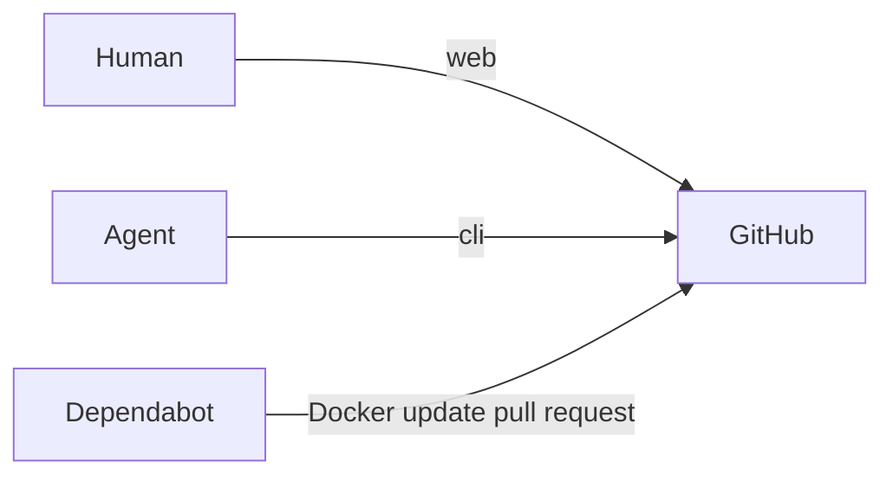

# Ecosystem

```mermaid
flowchart LR
    Human["Human"]
    Agent["Agent"]
    GitHub["GitHub"]
    Dependabot["Dependabot"]

    Human -- web --> GitHub
    Agent -- cli --> GitHub
    Dependabot -- Docker update pull request --> GitHub
```
